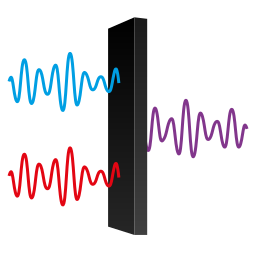

# zrtstr 
[](https://github.com/Indiscipline/zrtstr/blob/master/LICENSE)
> [Third Hemisphere Studio](https://thirdhemisphere.studio) tooling

Command line application for checking WAV-files for identical channels, detecting faux-stereo files generated by some audio-editing software and DAWs (such as old versions of Cubase). Outputs a true-mono WAV file on detection of faux-stereo. Takes the left channel of the input file, writes the converted file in the same location with the `-MONO` suffix in the name.


## Usage
Provide zrtstr with an input file as an argument, or run it from a directory full of target WAV files.

Full help available on `--help` switch.

## How does it work?
Zrtstr reads interleaved channel samples from a target stereo file one by one and compares left and right samples. If the difference is present (and higher than the threshold given in `--dither` mode) than file considered true-stereo and program tries to write a mono copy.

**Defaults include a reasonable dither threshold value, for strict checking set it to zero with `-d 0`!**

## Installation
Zrtstr is tested to work under Windows and GNU/Linux. Probably works on OSX with no changes.

### Download
**Binaries** for the main platforms are provided in [Releases](https://github.com/indiscipline/zrtstr/releases).

### How to build
Developed on nightly Rust, as stable makes getting samples for multiple channels a bit more problematic for `hound`.

Built using these wonderful crates: **[Hound](https://github.com/ruuda/hound)**, **[Clap](https://github.com/kbknapp/clap-rs)**, **[pbr](https://github.com/a8m/pb)**.

To build the program, download the source code and run:

```
$ cargo build --release
```

and the executable will be in `target/release/zrtstr`.

## TODO
Here are the current problems and planned features:

- [ ] Dither thresholding in dB
- [ ] Variable default dither threshold based on bitdepth
- [ ] Add automatic tests

## Contributing
The project is open for contributions. Any help and/or critique is appreciated. Take a stab at the TODO list above.

Feel free to file a bug report or feature request via [Issues](https://github.com/Indiscipline/zrtstr/issues).

## License
**zrtstr** licensed under GNU General Public License version 2 or later;

See `LICENSE` file for full details.
